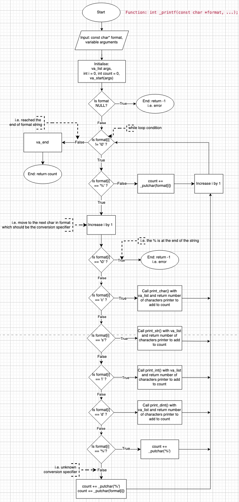

# _PRINTF Project

## Description
The _printf function formats and prints data to standard output(stdout) according to the specified format. The format specifier is a character string that contains conversion specifiers that indicates how the arguments should be formatted and displayed.

## Flowchart

## Contributors
<strong>sheeny84</strong> | <strong>by-emrii</strong> | <strong> carlaciar</strong>